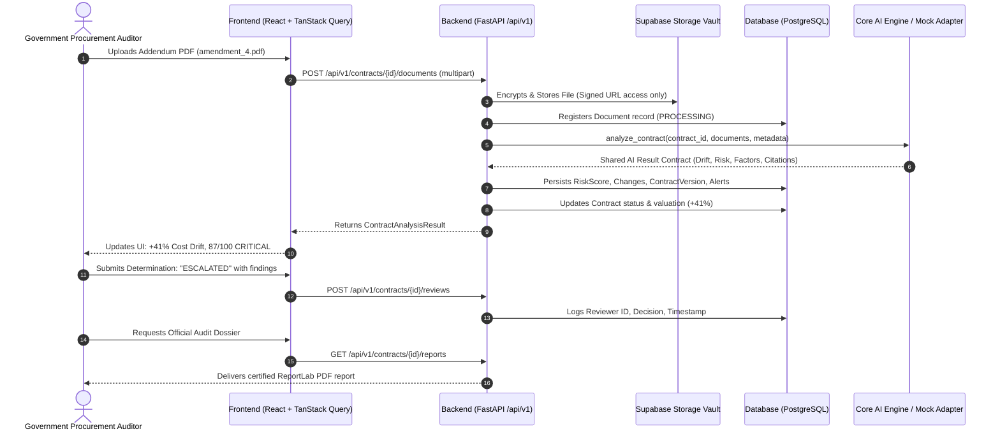

# Contract Guard — Architecture & Technical Design

## 1. System Overview & Philosophy

**Contract Guard** is a post-award government contract oversight and compliance decision-support system. It monitors the complete operational evolution of public procurement contracts from baseline tender award through amendments, progress reports, and contractor invoices.

### Role Boundary Policy
- **Platform Layer (Owned by Contract Guard)**:
  - Frontend user interface (React, Vite, TypeScript, Tailwind CSS)
  - Backend API orchestration (FastAPI, Pydantic v2, SQLAlchemy 2.x)
  - Persistent state and immutable version history (PostgreSQL / SQLite)
  - Authentication and role-based access control (Supabase Auth)
  - Secure document storage & signed URLs (Supabase Storage)
  - Human determination workflows (Under Review, Cleared, Escalated, Needs Evidence)
  - Certified PDF audit reporting (ReportLab)
  - AI Service integration adapter interface
- **Core AI Layer (External Service)**:
  - LLM prompt engineering
  - PDF document extraction & OCR
  - Sentence-transformers semantic embeddings
  - Semantic scope similarity & drift algorithms
  - Risk score calculation & factor weighting

> **CRITICAL COMPLIANCE DIRECTIVE**: Contract Guard is an advisory decision-support platform. It surfaces objective variances and signals (e.g. "Requires Review", "Material Change", "Deviation") without issuing criminal fraud accusations.

---

## 2. Monorepo Structure

```
contract-guard/
├── frontend/                     # React 18 + Vite + TypeScript + Tailwind CSS
│   ├── src/
│   │   ├── components/           # UI primitives, layout, dashboard, contracts, risk, timeline, etc.
│   │   ├── layouts/              # AppLayout, AuthLayout
│   │   ├── pages/                # Dashboard, Contracts, Detail, Upload, Alerts, Reports, Settings
│   │   ├── services/             # Domain API services
│   │   ├── types/                # Strict TypeScript schemas
│   │   └── lib/                  # Central API client, Supabase, and utilities
├── backend/                      # FastAPI Python Application
│   ├── app/
│   │   ├── api/routes/           # contracts, documents, versions, changes, risk, reviews, etc.
│   │   ├── core/                 # config, security, logging
│   │   ├── database/models/      # SQLAlchemy 2.0 entities
│   │   ├── schemas/              # Pydantic v2 models (Shared AI Result Contract)
│   │   └── services/             # Domain services & AI adapter
│   ├── alembic/                  # Database migration scripts
│   └── tests/                    # Pytest test suite
├── supabase/
│   ├── migrations/               # PostgreSQL schema & Row-Level Security
│   └── seed.sql                  # Synthetic demo seed data
├── data/demo/                    # JSON datasets for offline demonstration
└── docs/                         # Architecture documentation
```

---

## 3. Data Flow Architecture



---

## 4. Shared AI Result Contract Specification

The interface between the platform and the Core AI microservice adheres strictly to the following contract schema:

```json
{
  "contract_id": "PWD-2026-014",
  "current_version": 4,
  "drift": {
    "cost_percentage": 41.0,
    "schedule_days": 243,
    "scope_similarity": 0.68
  },
  "risk": {
    "score": 87,
    "level": "CRITICAL"
  },
  "risk_factors": [
    {
      "name": "Cost deviation",
      "score": 28,
      "weight": 0.30,
      "reason": "Current value is 41% above baseline."
    }
  ],
  "changes": [
    {
      "field": "contract_value",
      "old_value": 100000000,
      "new_value": 141000000,
      "absolute_change": 41000000,
      "percentage_change": 41,
      "severity": "HIGH",
      "evidence": [
        {
          "document_id": "doc-base-1",
          "filename": "contract.pdf",
          "page": 12,
          "source_text": "Clause 4.1: Total contract price is fixed at INR 10,00,00,000."
        }
      ]
    }
  ],
  "timeline": [
    {
      "version": 0,
      "label": "Baseline",
      "date": "2026-01-01",
      "contract_value": 100000000
    }
  ],
  "evidence": []
}
```

---

## 5. Security & Access Control

1. **Authentication**: Supabase Auth handles JWT token lifecycle. The backend verifies all tokens via `HTTPBearer` in `dependencies.py`.
2. **Authorization**: Roles `AUDITOR` and `ADMIN`. Audit workflows and determinations require authenticated user context; client claims are never trusted blindly.
3. **Storage Vault**: Document bucket `contract-documents` is non-public. Access is granted strictly via short-lived signed URLs generated on-demand.
4. **Data Isolation**: Row-level security policies ensure only authorized officers access procurement portfolios.
